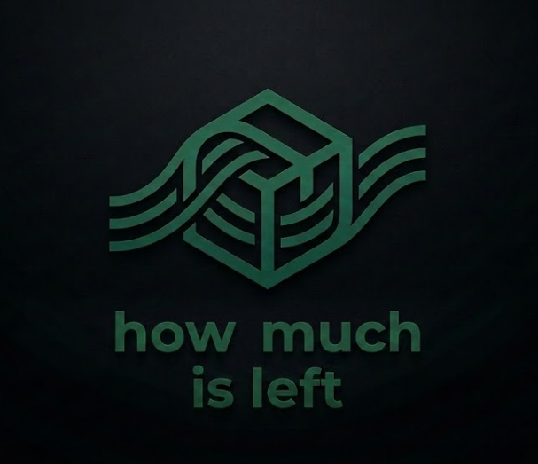
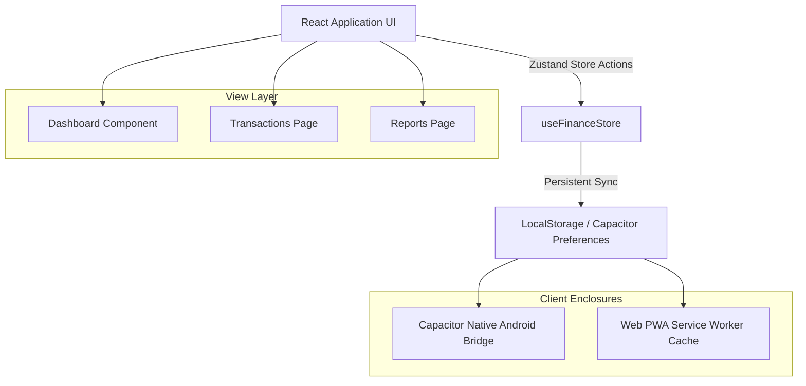

<div align="center">
  
  
  # How Much Is Left? 💸✨
  
  **Next-Gen Balance Flow & Savings Goal Tracker — Silent, Ambient, and Alive.**

  [](https://vitejs.dev/)
  [](https://react.dev/)
  [](https://capacitorjs.com/)
  [](https://tailwindcss.com/)
  [](https://web.dev/explore/progressive-web-apps)
</div>

---

**How Much Is Left?** is a highly customized, ultra-premium personal financial tracking application. Built with a "silent yet alive" design ethos, it provides a gorgeous, interactive overview of your financial flow. From beautiful welcome transitions to dynamic ambient breathing backdrops, it elevates budget allocation and savings tracking into an elegant, tactile experience.

### 📱 Platform Compatibility / ระบบปฏิบัติการที่รองรับ

| Platform / ระบบปฏิบัติการ | Installation Method / วิธีการติดตั้ง | Format / รูปแบบไฟล์ |
| :--- | :--- | :--- |
| **Android 🤖** | Download APK from **GitHub Releases** or Install via Google Chrome (PWA) | `.apk` file / Web Install |
| **iOS (iPhone/iPad) 🍏** | Open in **Safari** browser ➔ **Add to Home Screen** (PWA) | Web Install (No file needed) |
| **Desktop & Web 💻** | Instant access on all modern browsers (Chrome, Safari, Edge, Firefox) | Direct Web Link |

Runs as a native **Android Application** (via Capacitor) or installs instantly as an offline **Progressive Web App (PWA)** on both iOS and Android.

---

## 🌌 Living & Breathing Visuals

The application has been upgraded with a high-fidelity visual design system, making the interface feel responsive, tactile, and alive:

* **💨 Ambient Breathing Backdrop**: Three large, extremely subtle colored radial blur spots (Emerald, Purple, Blue) rotate and float slowly behind the dark glass layout, simulating a calm breathing rhythm.
* **✨ Fluid Navigation Transitions**: An advanced keyed-rendering system triggers a smooth **Slide-Up & Fade** transition every time a screen or bottom tab is changed.
* **📈 Living Number Count-Up**: The central total wallet flow display interpolates numerical changes on mount and update, counting up or down smoothly using custom ease-out-expo interpolations for a premium fintech feel.
* **🟢 Living Pulse Status Banner**: A real-time breathing status chip with a neon radar pulsing indicator. It monitors daily inflows/outflows and suggests smart financial tips and encouragement dynamically in both Thai and English.
* **🛍️ Tactile Glow Menu Cards**: Action cards (Add Expense, Add Income, Goals, Lump Sum) feature custom colored hover borders, floating physics, and soft matching drop-shadows with scale-down clicks (`active:scale-[0.95]`) for satisfying visual haptics.

---

## 🛠 Features Matrix

* **💰 Comprehensive Dashboard**: A high-contrast central flow display showing your cumulative cash volume with progressive budget indicators.
* **📊 Smart Filter Tagbar**: Fully redesigned, ultra-compact tags (`h-8 rounded-lg`) that dynamically hide or show categories depending on the active flow type (Income vs Expense), reducing visual noise by 40%.
* **🎯 Savings & Budget Pockets**: Set up target-based pockets (e.g., buying a new MacBook) or recurring savings indicators. Supports automatic percentage allocations from income recordings.
* **🎁 Windfall Lump Sums**: Record single windfall sums and divide them into customized expense allocations, automatically updating your net balance as allocations are marked "Spent".
* **🗂️ Localized Support**: Instantly toggles between Thai (TH) and English (EN) with Noto Sans Thai and Inter typography.

---

## 📐 Architecture & Flow

The application follows a lightweight, high-performance hybrid architecture with completely local persistent storage.



---

## 🚀 Getting Started

### 📋 Prerequisites

- **Node.js** (v18.0 or higher recommended)
- **NPM** (v9.0 or higher)
- **Android Studio** (for building the native `.apk`)

### 📦 Setup & Development

1. **Clone the repository:**
   ```bash
   git clone https://github.com/Mike0165115321/how-much-is-left.git
   cd how-much-is-left
   ```

2. **Install dependencies:**
   ```bash
   npm install
   ```

3. **Run local dev server:**
   ```bash
   npm run dev
   ```
   Open `http://localhost:3000` to view the app in your browser with hot-reload active.

---

## ⚙️ Compilation, Release & Installation

The application is built on a unified codebase. You do **not** need separate code folders for Android and iOS! You can distribute it in two ways:

1. **Direct Android APK**: Share the compiled `how-much-is-left.apk` file (e.g. via Google Drive/OneDrive) so Android users can install it instantly.
2. **Unified PWA Web App**: Deploy your built files to the web for free. **This is the ONLY and BEST way to support iOS (iPhone/iPad) users** as well as Android users who prefer not to download an APK. When iOS Safari users open your link, a custom in-app **iOS Install Guide** will slide up and show them exactly how to install it.

---

### 📲 Mobile Installation Guide

#### 🍏 For iOS (iPhone & iPad)
iOS users can install the application in 3 quick steps:
1. Open your deployed website URL in the native **Safari** browser (e.g. `https://your-app.vercel.app`).
2. Tap the **Share** button on Safari's bottom toolbar (square icon with an upward arrow).
3. Scroll down and select **"Add to Home Screen"** (เพิ่มไปยังหน้าจอโฮม). 

*The application will instantly install as a full-screen, standalone app on the Home Screen, loading offline via its service worker cache.*

#### 🤖 For Android
Android users have two convenient installation options:
* **Option A (Easy Web Install)**: Open the deployed website URL in **Google Chrome**, wait for Chrome to prompt "Add to Home Screen", or tap the three dots in Chrome and select **"Install App"**.
* **Option B (Direct APK)**: Download and run the `how-much-is-left.apk` file on your device.

---

### 🚀 How to Build & Deploy

<details>
<summary><b>📱 Build Native Android APK</b></summary>

1. **Compile web production bundle:**
   ```bash
   npm run build
   ```
2. **Synchronize assets and plugins with Android project:**
   ```bash
   npx cap sync android
   ```
3. **Generate native adaptive icons & splash screens:**
   ```bash
   npx @capacitor/assets generate --android --assetPath assets/android
   ```
4. **Compile standard APK directly:**
   ```bash
   cd android
   ./gradlew assembleDebug
   ```
   *The compiled `.apk` will be output to `android/app/build/outputs/apk/debug/app-debug.apk`.*
</details>

<details>
<summary><b>🌐 Host the Web App for Free (Vercel)</b></summary>

Deploying to the web allows anyone (especially iOS users) to access and install the app:
1. **Compile production build:**
   ```bash
   npm run build
   ```
   *(This builds all optimized, production-ready static files into the `dist` folder).*
2. **Deploy instantly for FREE:**
   Install Vercel's CLI and deploy:
   ```bash
   npm install -g vercel
   vercel
   ```
   *Follow the quick CLI instructions to log in. Point the project root to this repository, and it will automatically deploy the built `dist` folder. Your secure, offline-ready web app will be live with a custom URL instantly!*
</details>

---

## 📂 Project Anatomy

- `src/app/` — Routing screens (Dashboard, Transactions, Reports, Lump-sums, Goals).
- `src/components/` — Visual helper components (`SplashScreen.tsx`, `AnimatedNumber.tsx`).
- `src/store/` — Central Zustand configuration for wallet state data and local persistence.
- `public/` — Public web assets (`manifest.json`, `sw.js` offline caching, `favicon.png`).
- `assets/` — High-resolution source images for mobile adaptive icon configurations.
- `android/` — Native Android Gradle wrapping configurations.

---

<div align="center">
  <h3>How Much Is Left? — Crafted with ❤️ for financial clarity and premium design.</h3>
  <p>Download the latest release now: <b><a href="https://github.com/Mike0165115321/how-much-is-left/releases/tag/v1.0.0">v1.0.0 (Release) 📦</a></b></p>
</div>
